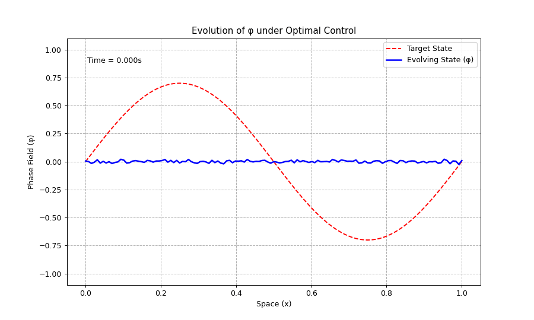

# Sparse Optimal Control of Viscous Cahn-Hilliard Systems


A high-performance computational framework for solving **sparse optimal control problems** governed by the **Viscous Cahn-Hilliard (vCH)** equation with a logarithmic potential.

This project implements a **Proximal Gradient Descent (PGD)** algorithm to steer phase separation processes. It features robust forward solvers (Newton-Raphson), adjoint-based gradient computation, and an interactive configuration system.

---

## 🎥 Demonstration

| 1D Control Evolution | 2D Target Steering |
|:--------------------:|:------------------:|
|  |  |
| *Evolution of phi under Optimal Control* | *Controlled Phase Separation* |

---
**Note:** The graphics displayed above are for demonstration purposes and may differ slightly from current outputs due to code updates. All default parameters are defined in `config.py`; you can modify them directly in that file or adjust them interactively by running the main driver scripts.
## 🌟 Key Features

* **Multi-Dimensional:** Fully supported solvers for both **1D** and **2D** domains.
* **Physics-Fidelity:**
    * Models **Viscous** Cahn-Hilliard dynamics (inertial effects).
    * Uses the **Logarithmic Flory-Huggins potential** ensuring physical bounds ($-1 < \varphi < 1$).
* **Robust Numerics:**
    * **Forward Solver:** Semi-implicit Crank-Nicolson scheme with convex-concave splitting and monolithic Newton-Raphson iteration.
    * **Adjoint Solver:** Efficient backpropagation-through-time for exact gradient computation.
* **Sparse Control:** Implements **Proximal Gradient Descent (ISTA)** to handle non-smooth $L^1$ regularization, promoting energy-efficient, sparse actuation.
* **Interactive CLI:** User-friendly prompts to configure grid size, weights, targets, and time steps without touching code.
* **Verification:** Includes automated checks for **KKT conditions** (first-order) and **Coercivity** (second-order sufficient conditions).

---

## 🧠 Mathematical Model

### 1. The State System
We control the phase-field variable $\varphi$ and chemical potential $\mu$ via an external control $u$, filtered through an auxiliary variable $w$. As detailed in the project report:

$$
\begin{cases}
\partial_t \varphi - \Delta \mu = 0 \\
\tau \partial_t \varphi - \kappa \Delta \varphi + f'(\varphi) = \mu + w \\
\gamma \partial_t w + w = u
\end{cases}
$$

* $\tau$: Viscosity/relaxation parameter.
* $\kappa$: Gradient energy coefficient (interface width).
* $f'(\varphi)$: Derivative of the logarithmic double-well potential.

### 2. The Optimization Problem
We minimize a cost functional $J(\varphi, u)$ composed of four terms:

$$
\min_{u} J(\varphi, u) = \underbrace{\frac{b_1}{2} ||\varphi - \varphi_Q||_{L^2}^2}_{\text{Trajectory Tracking}} + \underbrace{\frac{b_2}{2} ||\varphi(T) - \varphi_\Omega||_{L^2}^2}_{\text{Terminal Target}} + \underbrace{\frac{b_3}{2} ||u||_{L^2}^2}_{\text{Control Energy}} + \underbrace{\kappa_{spar} ||u||_{L^1}}_{\text{Sparsity}}
$$

The non-differentiable $L^1$ term is handled via **Soft-Thresholding**, ensuring the control $u(x,t)$ is zero where actuation is not strictly necessary.

---

## 🚀 Installation

### Prerequisites (Min)
* Python 3.11+ 
* RAM: ~4GB recommended for 2D simulations.

### Setup

1.  **Clone the repository:**
    ```bash
    git clone [https://github.com/YOUR_USERNAME/Viscous_Cahn_Hilliard.git](https://github.com/YOUR_USERNAME/Viscous_Cahn_Hilliard.git)
    cd Viscous_Cahn_Hilliard
    ```

2.  **Create a virtual environment (Recommended):**
    ```bash
    conda create -n ch-opt python=3.11 -y
    conda activate ch-opt
    ```

3.  **Install dependencies:**
    ```bash
    pip install -r requirements.txt
    ```

---

## 💻 Usage

The simulators are designed to be run from the **project root directory**.

### Interactive Mode
Run the driver script. [cite_start]You will see a "Forward Preview" first, followed by prompts to configure the optimization (weights, steps, targets).

**To run the 1D Simulator:**
```bash
python 1d/Vch_control_1D/GD_1D.py
```

**To run the 2D Simulator:**
```bash
python 1d/Vch_control_2D/GD2_configured.py
```

## 📚 References

1.  P. Colli, J. Sprekels, and F. Tröltzsch, "Optimality Conditions for Sparse Optimal Control of Viscous Cahn-Hilliard Systems with Logarithmic Potential," *Applied Mathematics & Optimization*, 2024.